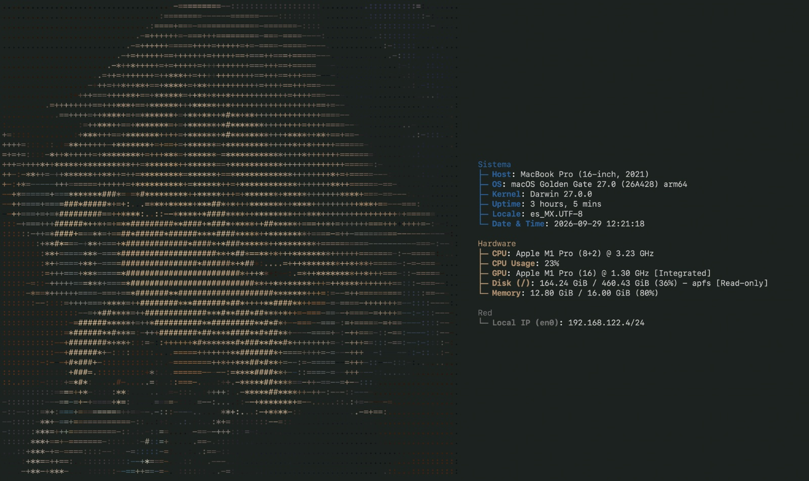

# fastfetch — Furina

Config personal de [fastfetch](https://github.com/fastfetch-cli/fastfetch) con el logo de Furina en ASCII.

fastfetch lee `config.jsonc` desde `~/.config/fastfetch`. Este repo está pensado para macOS: el logo usa una ruta absoluta y solo corre si los archivos están en esa carpeta.

```jsonc
"source": "/Users/{user}/.config/fastfetch/text-color.txt"
```

## Muestra



## Qué incluye

- `config.jsonc` — módulos y colores
- `text-color.txt` — ASCII de Furina con color, es el logo que usa fastfetch
- `text.txt` — el mismo ASCII en texto plano
- `ascii-art.png` — referencia de la imagen

## Módulos

- **Sistema:** host, OS, kernel, uptime, locale, fecha y hora
- **Hardware:** CPU, uso de CPU, GPU, disco y memoria
- **Red:** IP local
